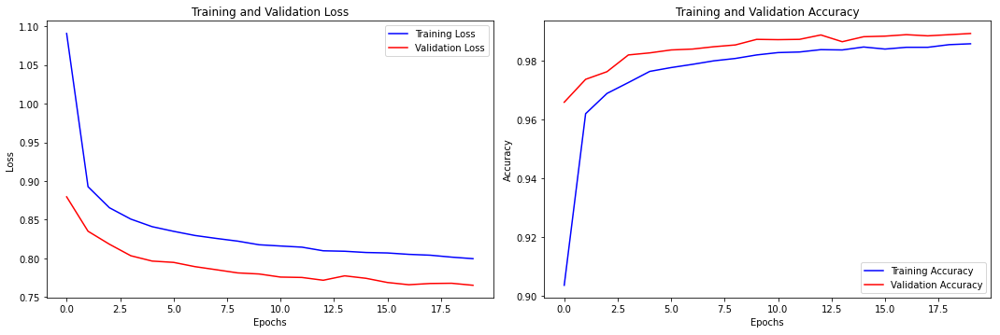
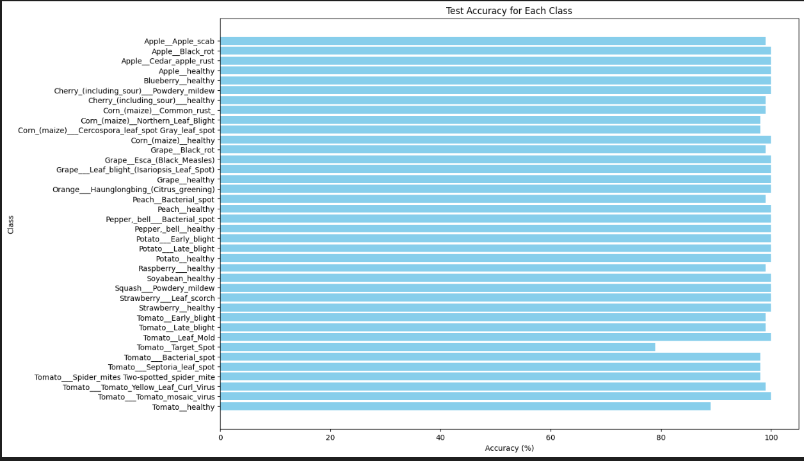

🌿 Plant Disease Detection using Swin Transformer
A Smart, Scalable, and Conversational AI for Farmers
🚀 Project Highlights
✅ Deployable on Low-Power Devices – Model optimized for edge deployment, ideal for real-world farm use where high-end hardware isn't available.

🌍 Supports 150+ Languages – Frontend and chatbot are multilingual, ensuring accessibility across regions and user demographics.

💬 AI Chatbot for Cure & Prevention – Integrated AI assistant helps users understand symptoms and suggests preventive measures and treatments.

📸 High-Accuracy Detection – Achieved 98.94% validation accuracy on a dataset of 100,000+ images across 38 plant disease classes.

🔧 Tech Stack
Model: Swin Transformer (Vision Transformer)

Training: PyTorch, Adam optimizer, Cross-Entropy loss

Frontend: React.js (Multilingual UI)

Backend: Django REST API + AI-powered chatbot

Deployment-Ready: Lightweight model enables deployment on mobile and edge devices

🌱 Why This Project is Unique
Traditional plant disease models are too large or require heavy compute. This project is different:

It's lightweight, multilingual, and interactive

Designed for real farmers, not just benchmarks

Combines state-of-the-art AI with practical usability

🎯 Use Case
Farmers can:

Upload a leaf photo

Get instant disease prediction

Chat with the AI assistant to learn about causes, cures, and prevention — in their native language.

## Evaluation

The model is evaluated on a separate test set. The evaluation metrics include:
- **Test Loss**
- **Test Accuracy** (per class and overall)

## Results
Best Val Acc: 98.94%

Test Accuracy of 98% (9744/9856)

THANKYOU
